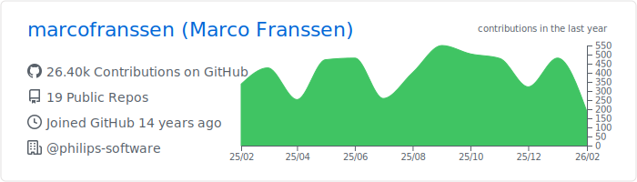
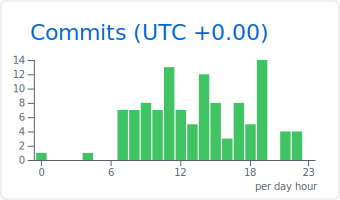

### Hi there 👋

My name is Marco Franssen. I work as a Senior Architect at Philips - Research.

- 🔭 I’m currently working on Cloud topics and investigating a bunch of CNCF projects like Notary v2, SPIFFE/Spire and the list goes on.
- 🌱 I’m currently learning a variety of different CNCF projects related to k8s.
- 👯 I’m looking to collaborate on any Open Source project that comes on my path. 
- 💬 Ask me about Scuba diving and any Golang related topics.
- 📫 How to reach me: ✨<https://marcofranssen.nl>✨
- You are visitor NR ⤐  
<!--
- 🤔 I’m looking for help with ...
- 😄 Pronouns: ...
- ⚡ Fun fact: ...
-->

### Languages & Tools 🛠  

### Stats ⚙️

### Let's connect? 🤝

[Blog](https://marcofranssen.nl)

